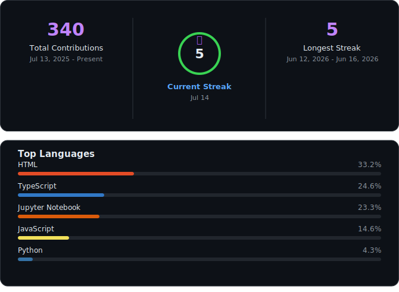

<h1 align="center">Hi 👋, I'm Akshath Senthilkumar</h1>
<h3 align="center">Computer Science Student | Full-Stack Developer | Data & AI Enthusiast</h3>

  
  
  
  

  

---

### 🚀 About Me

- 🎓 B.Tech Computer Science Engineering (Data Science) @ SRM Institute of Science and Technology, Chennai — Class of 2027
- 💻 Currently building full-stack products spanning React/Node/FastAPI, and exploring applied AI with LLM integrations (Gemini, RAG pipelines)
- 🧪 Recently worked as a Product Developer Intern @ Spinwisely LLC, building backend systems for a multi-tenant SaaS platform for textile mills
- 🏆 3rd place nationally at Fintech-A-Ton, NIT Trichy — led a team of 5 to build a working AI product in 24 hours
- 🌱 Currently sharpening data structures & algorithms, system design fundamentals, and exploring agentic AI workflows
- 💬 Ask me about: full-stack architecture, RAG pipelines, ML pipelines (time-series/TFT), or building fast with FastAPI + React
- 📫 Reach me: s.akshath31@gmail.com

---

### 🛠️ Tech Stack

**Languages**

**Frontend & Backend**

**Databases**

**Cloud, Tools & DevOps**

**AI/ML**

---

### `// STACK`

| Domain | Tools |
|---|---|
|  | React · TypeScript · Node.js · Express.js · FastAPI |
|  | PostgreSQL · MongoDB · Supabase · REST APIs |
|  | PyTorch · scikit-learn · Gemini · RAG Pipelines |
|  | Git · GitHub · Docker · Vercel · Postman |

---

### 📊 GitHub Stats

  

---

<i>Building things, one repo at a time 🚀</i>
